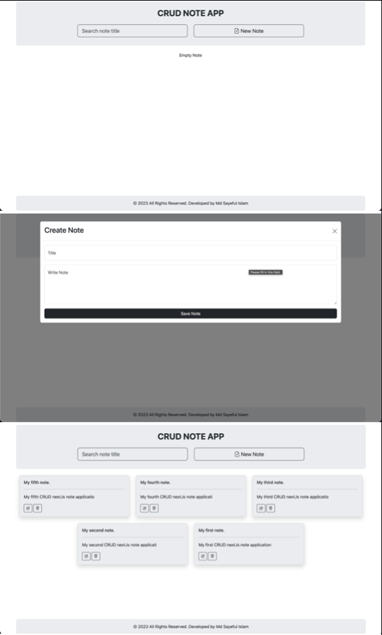
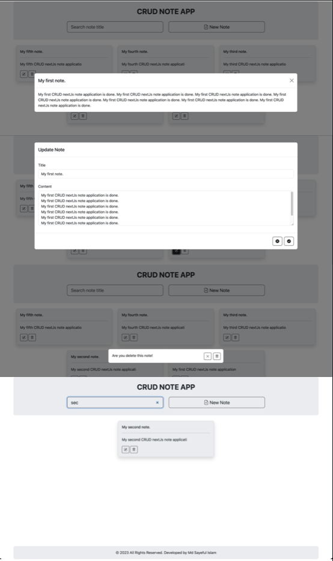
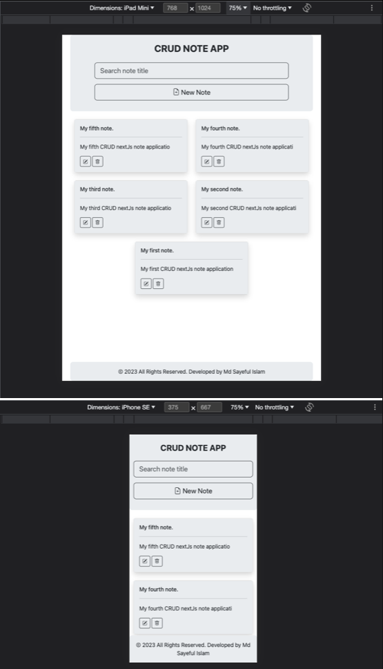

This is a responsive nextJs-full-stack web note app.
This web app using dependencies are:
```bash
"axios": "^1.4.0",
"bootstrap": "^5.3.1",
"bootstrap-icons": "^1.10.5",
"mongoose": "^7.4.2",
```

Application functionality are:
- Create new note
- Update note
- Delete note
- Search note
- Backend server using NextJs API Routes
- responsive large, laptop, tablet, mobile screen.
- Loading indicator

## Getting Started

1. First download the code and run:
```bash
npm install
```

2. Start mongodb server.

3. Run the development server:
```bash
npm run dev
# or
yarn dev
# or
pnpm dev
```

Open [http://localhost:3000](http://localhost:3000) with your browser to see the result.

## Laptop view



## Tablat and Mobile view

